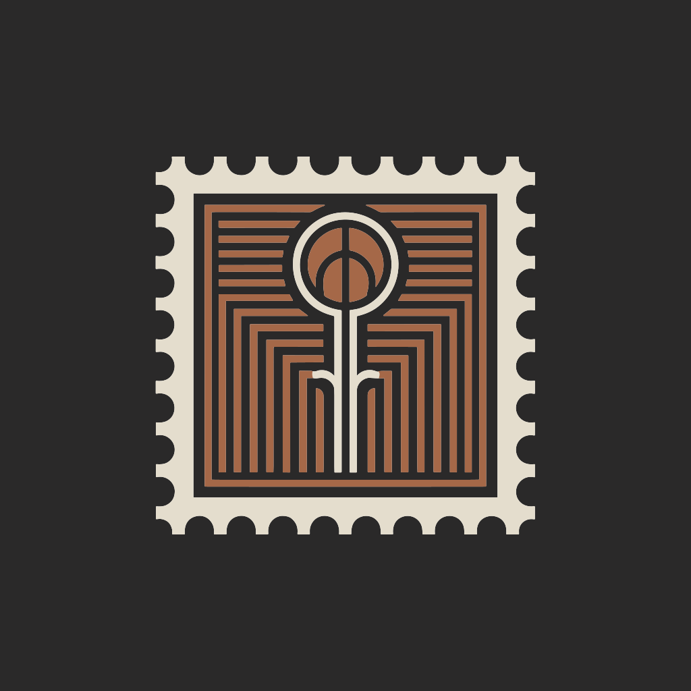

<p align="center">
  
</p>

<h1 align="center">Stamp</h1>

<p align="center">
  <a href="https://github.com/dmoore-dwmmholdings/Stamp/actions/workflows/ci.yml"></a>
  <a href="LICENSE"></a>
  <a href="https://github.com/dmoore-dwmmholdings/Stamp/releases"></a>
  <a href="https://www.python.org/"></a>
  <a href="https://github.com/astral-sh/ruff"></a>
  <a href="https://hits.sh/github.com/dmoore-dwmmholdings/Stamp/"></a>
</p>

Stamp is a desktop app that puts 2D artwork onto 3D parts as real geometry — not a
decal, not a texture.

You bring a 3D part (STEP or STL) and a 2D profile (SVG, DXF, or DWG): a logo, a
serial number, a slot pattern, a keep-out shape. Stamp turns that profile into
geometry on the part — raised, engraved, or cut clean through, with fillets or
chamfers on the edges if you want them. Drag it into place with the mouse, type
exact numbers where it matters, then export STEP for the machine shop and STL for
the printer.

## Install

Download the latest `Stamp-x.y.z-Setup.exe` from the
[releases page](https://github.com/dmoore-dwmmholdings/Stamp/releases) and run it.
It installs for the current user only, so no administrator password is needed, adds
a Start menu shortcut, and registers the `.stamp` file type.

On other platforms, or if you'd rather run from source:

```
uv sync
uv run stamp
```

You can also pass a file on the command line:

```
uv run stamp tests/fixtures/bracket.step
uv run stamp my_project.stamp
```

## The workflow

1. Open a part.
2. Add a profile.
3. Click the face it belongs on.
4. Dial in the size and position in the properties panel.
5. Pick the depth and the operation.
6. Add a fillet or chamfer if you want one.
7. Export.

## Text

No artwork file? Type it instead.

1. Open a part.
2. Press Ctrl+T, or click "+ Add text".
3. Click the face the text belongs on.
4. Type your text in the properties panel.
5. Pick the font, size, and formatting.
6. Pick the depth and the operation.

Font size is the em size in millimeters. Text supports everything a logo does — cut
it into the part or raise it out, fillet or chamfer the edges. Formatting covers
font, size, bold, italic, underline, alignment, wrap width, letter spacing, and line
spacing (justify needs a wrap width).

A text feature stores the text itself in the project file, so there is no artwork
file to lose.

## Fillets and chamfers

A fillet applies to every edge of the selection in one operation, and one edge that
can't take the radius fails it for all of them — so the radius has to suit the
smallest detail in the artwork.

If the radius is too large, Stamp finds the largest one that works, applies it
automatically, and tells you what it did.

Detailed artwork has short edges and can only take a small radius. For a bigger
radius, make the artwork bigger or simpler.

Chamfers work the same way, and the distance has the same limit as the radius.

Modifiers aimed at the edges where a feature meets the part act on the joined
result: at the base of a raised feature they flare outward into the surface, and
on the rim of a pocket they widen the mouth.

## Multi-color printing

"Export 3MF" writes the part as separate bodies: the base, plus one body per
feature. Raised artwork becomes its own solid, and engraved artwork becomes an
inlay that fills the pocket flush with the surface — so a color printer can put
the artwork in a second filament. Through cuts stay open.

The file is a standard multi-object 3MF with display colors, plus the filament
slot assignments Bambu Studio and OrcaSlicer read (base on slot 1, features on
slot 2). Open it in Bambu Studio, answer **Yes** when it asks to load the parts
as a single object with multiple parts, and slice — each body arrives bound to
its filament, and the display colors are matched against your loaded filaments.
Other slicers see a plain multi-object 3MF and let you assign materials per
part.

## The two kinds of part

A STEP file is a solid with exact surfaces. An STL is a bag of triangles. Stamp
never pretends one is the other.

| Input | Boolean engine | Blend into the part | Export |
|---|---|---|---|
| STEP, IGES, BREP | OpenCascade | Yes | STEP and STL |
| STL, 3MF, OBJ | manifold3d | No | STL only |

The tool solid is always a B-rep in both modes, which is why a fillet on the top
edge of a raised logo works even on an STL part. Blending into the surrounding
surface is different — that needs exact surfaces.

STL in means STL out. Stamp won't invent surfaces it doesn't have, so if the shop
needs a STEP file, start from a STEP file.

## What Stamp doesn't do

- Full parametric sketching — profiles come from files.
- Assemblies, multiple bodies, materials.
- Editing the part's original geometry.
- Toolpaths, drawings, GD&T.
- Cloud, accounts, plugins.

## Project layout

| Path | Content |
|---|---|
| `src/stamp/core/` | The document, anchors, and the rebuild engine. |
| `src/stamp/io/` | Import, normalization, export, and the project archive. |
| `src/stamp/geom/` | The tool solid, the OCC path, and the mesh path. |
| `src/stamp/ui/` | The window, viewport, feature tree, and properties panel. |
| `tests/` | The test suite and its fixtures. |
| `packaging/` | The PyInstaller spec and the installer script. |

A `.stamp` project is a plain zip archive: a manifest, a copy of the part, a copy of
each profile, and a thumbnail. No geometry is stored — everything rebuilds from the
sources. Any unzip tool can open one.

## Logs and crash reports

Stamp writes a log on every start. On Windows it lives at
`%LOCALAPPDATA%\Stamp\logs\stamp.log`.

If Stamp crashes, the next start offers to report it, and "Report a crash" /
"Report a bug" are available any time. Stamp drafts the email for you — details,
machine info, the last lines of the log — so all you do is look it over and send it.
Nothing is ever sent automatically. Since a `mailto:` link can't carry an
attachment, the full report also goes to a file, and the email names it.

## Building the Windows installer

```
python -m uv run python packaging/make_icons.py
python -m uv run pyinstaller packaging/stamp.spec --noconfirm --distpath build/dist --workpath build/work
ISCC.exe packaging/stamp.iss
```

The result is a single `Stamp-x.y.z-Setup.exe` in `packaging/dist/`. A tagged
release builds this automatically and attaches it to the GitHub release.

## Development

```
uv run pytest
uv run ruff check src tests
uv run python tests/make_fixtures.py
```

Every push runs lint and the test suite on Windows and Linux via GitHub Actions
(`.github/workflows/ci.yml`). Tests that need a real window and OpenGL are skipped
there — the runners are headless.

`PROGRESS.md` tracks milestone status and records the hard-won findings worth
keeping.

## License

MIT — see [`LICENSE`](LICENSE).
